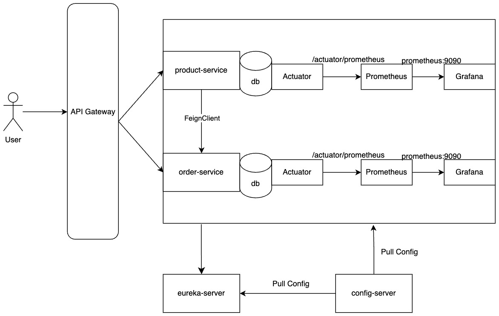

# Microservices E-Commerce Projesi

Bu proje, modern e-ticaret sistemlerinin gereksinimlerini karsilamak uzere tasarlanmis mikroservis mimarisi tabanli bir uygulamadir.

## Sistem Mimarisi

<p align="center">
    
</p>

## Teknoloji Stack'i

- Java 17
- Spring Boot 3.4.2
- Spring Cloud
- PostgreSQL
- Docker & Docker Compose
- Prometheus & Grafana (Monitoring)
- Eureka Server (Service Discovery)
- API Gateway
- Config Server

## Servis Mimarisi

Proje asagidaki mikroservisleri icermektedir:

1. **Config Server**: Merkezi konfigurasyon yonetimi
2. **Eureka Server**: Servis kesfi ve yuk dengeleme
3. **Gateway Service**: API Gateway ve routing
4. **Product Service**: Urun yonetimi
5. **Order Service**: Siparis yonetimi

## Monitoring ve Observability

- Prometheus: Metrik toplama
- Grafana: Metrik gorsellestirme ve dashboard'lar
- Spring Boot Actuator: Servis sagligi ve metrikleri

## Baslangic

### On Gereksinimler

- Docker ve Docker Compose
- Java 17
- PostgreSQL

### Kurulum

1. Projeyi klonlayin:
```bash
git clone [repo-url]
```

2. Docker container'larini baslatin:
```bash
docker-compose up -d
```

3. Servisleri sirasiyla baslatin:
    - Config Server
    - Eureka Server
    - Diger servisler

### Erisim Noktalari

- Eureka Server: http://localhost:8761
- API Gateway: http://localhost:8080
- Prometheus: http://localhost:9090
- Grafana: http://localhost:3000

## Veritabani

PostgreSQL veritabani Docker uzerinde calismaktadir:
- Port: 5432
- Kullanici adi: postgres
- Sifre: toor

## API Dokumantasyonu

API endpoint'leri ve kullanimlari icin Postman koleksiyonu: `ecommerce.postman_collection.json`

## Monitoring

Grafana uzerinden sistem metriklerini goruntulemek icin:
- URL: http://localhost:3000
- Kullanici adi: admin
- Sifre: admin